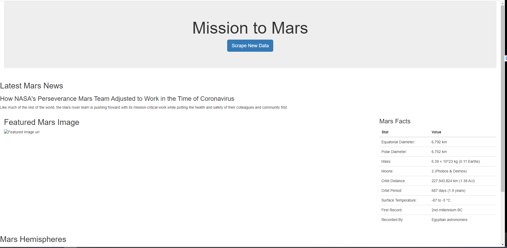

# web-scraping-challenge
Web scraping application to create a Mars Fact webpage
## [App](Missions_to_Mars/app.py)
App used to create webpage. Has Image URLs, but won't display for unknown reason.
## [Scraping](Mission_to_Mars/scrape_mars.py)
App used to scrape Mars information from the web
## [Notebook](Mission_to_Mars/mission_to_mars.ipynb)
Jupyter Notebook used to test scraping
## [Templates](Mission_to_Mars/templates)
HTML and CSS used to format webpage

